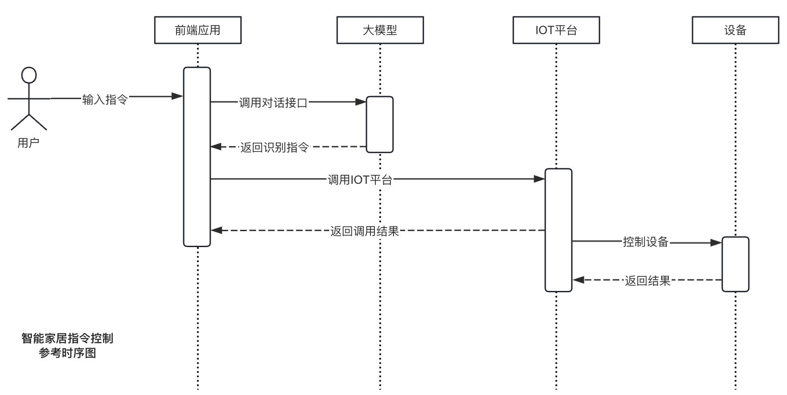

# 绿城智能家居指令大模型
<div align="center">


  <div align="center">
    <b><font size="5">SmartHomeCLLM</font></b>
  </div>

[![license][license-image]][license-url]
[![evaluation][evaluation-image]][evaluation-url]
[![LMDeploy][LMDeploy-image]][LMDeploy-url]
[![XTuner][XTuner-image]][XTuner-url]


[![OpenXLab_Model][OpenXLab_Model-image]][OpenXLab_Model-url] 
[![OpenXLab_App][OpenXLab_App-image]][OpenXLab_App-url] 

[🤔Reporting Issues][Issues-url]  


[license-image]: https://img.shields.io/badge/license-GPL%203.0-green
[evaluation-image]: ./images/compass_support.svg
[OpenXLab_Model-image]: https://cdn-static.openxlab.org.cn/header/openxlab_models.svg
[LMDeploy-image]: https://img.shields.io/badge/LMDeploy-Support-blue
[XTuner-image]: https://img.shields.io/badge/XTuner-Support-blue
[OpenXLab_App-image]: https://cdn-static.openxlab.org.cn/app-center/openxlab_app.svg

[license-url]: ./LICENSE
[evaluation-url]: https://github.com/internLM/OpenCompass/
[OpenXLab_Model-url]:https://openxlab.org.cn/models/detail/Greentown/Greentown_SmartHomeCLLM
[LMDeploy-url]: https://github.com/internLM/LMDeploy
[XTuner-url]: https://github.com/internLM/XTuner
[OpenXLab_App-url]: https://openxlab.org.cn/apps/detail/Greentown/Greentown_SmartHomeCLLM
[Issues-url]: https://github.com/jujunchen/SmartHomeCLLM/issues
</div>

## 📝目录

- [📖 简介](#-简介)
- [🚀 News](#-news)
- [📦 Model Zoo](#-ModelZoo)
- [⚡️ 性能](#-性能)
- [🛠️ 使用方法](#-使用方法)
    + [文件说明](#文件说明)
    + [环境搭建](#环境搭建)
    + [运行Demo](#运行Demo)
    + [微调](#微调)
    + [部署](#部署)
    + [评测](#评测)
- [技术报告](#技术报告)
- [致谢](#致谢)
- [开源许可证](#开源许可证)


## 📖 简介
智能家居指令大模型，由绿城未来数智通过数十万条智能家居控制指令基于internLM2_chat_7b微调训练而成，大模型能够根据用户上下文识别出文本中的指令、设备名称、空间名称、接口、回复、场景、设备id、场景id，值等，并返回JSON结构，可供IOT平台进一步的指令解析、执行、控制。配合prompt工程，可以实现设备、场景数据的动态识别。




## 🚀 News
- 2024.03.12 项目第一版上线
## 📦 ModelZoo
| 模型名称 | OpenXLab | Release Date |
| :----: | :----: | :----: |
| InternLM2-Chat-7B-SFT-SMC-V1.0	 | [![OpenXLab_Model][OpenXLab_Model-image]][OpenXLab_Model-url] | 2024.03.12 |
## ⚡️ 性能
使用OpenCompass进行测试，结果如下：
|dataset|     version|    metric|    mode|      InternLM2-Chat-7B-SFT-SMC-V1.0|
| :----: | :----: | :----: | :----: | :----: |
|smart_home|  7c7205|     accuracy|  gen|                             71.91|
## 🛠️ 使用方法
### 文件说明
- app.py:  openxlab 应用代码，通过api接口调用部署在测试服务器上的前端应用接口
- requirements.txt:  openxlab 应用依赖包列表
- gradio_demo.py:  使用gradio搭建的前端应用，可以直接调用大模型，用于展示模型效果，内置了设备数据、场景数据。要体验大模型的指令识别能力，可以运行该文件。
- internlm2_chat_7b_qlora_smarthome_e30.py: 微调训练配置文件
- 模型评测结果: 包含模型评测结果文件

### 环境搭建
1. clone 本项目
```bash
git clone https://github.com/jujunchen/SmartHomeCLLM.git
cd SmartHomeCLLM
```
2. 创建虚拟环境

```bash
conda create --name smartHomeCLLM python=3.10 -y
conda activate smartHomeCLLM
``` 
3. 安装依赖
```bash
pip install gradio==4.21.0
pip install requests
pip install torch
pip install transformers
pip install sentencepiece
pip install einops
pip install accelerate
```
4. 模型下载
```bash
# HTTP下载：
git lfs install
git clone https://code.openxlab.org.cn/Greentown/Greentown_SmartHomeCLLM.git
```
### 运行Demo
1. 在线Demo体验
> - 为了部署到openXLab，我们开发了跟演示视频不同的Demo，该Demo也对接了实验室的IOT平台，能真实控制实验室设备
>
> - 直播地址能够实时看到设备控制情况，由于摄像头问题，*请在手机端打开观看，视频流有20秒左右延迟，请评委耐心等待一下...有时候会打不开，麻烦评委多尝试一下...*

演示地址：https://openxlab.org.cn/apps/detail/Greentown/Greentown_SmartHomeCLLM  
直播地址：http://test.aliali.vip/video


2. 本地运行
> 本地运行Demo，能够体验大模型的指令识别能力
```bash
# 修改为模型路径
model_name_or_path = "./Greentown_SmartHomeCLLM/"

# 运行demo
python gradio_demo.py
```
 
### 微调
1. xtuner 安装
```bash
pip install -U 'xtuner[deepspeed]'
```
2. 数据集准备
数据格式应该是如下这样的json格式，保存为.jsonl文件
```bash
[
    {
        "conversation": [
            {
                "system": "你现在是一个智能家居AI助手", 
                "input": "打开主卧灯。", 
                "output": "{\"type\":\"iot_device\",\"response\":\"已为您打开主卧灯\",\"api\":\"\",\"params\":{\"device_id\":\"11\",\"device\":\"灯\",\"space\":\"主卧\",\"action\":\"P2_0xCF\",\"value\":\"100\"}}"
            }
        ]
    }, 
    {
        "conversation": [
            {
                "system": "你现在是一个智能家居AI助手", 
                "input": "关闭主卧灯。", 
                "output": "{\"type\":\"iot_device\",\"response\":\"已为您关闭主卧灯\",\"api\":\"\",\"params\":{\"device_id\":\"11\",\"device\":\"灯\",\"space\":\"主卧\",\"action\":\"P2_0xCF\",\"value\":\"100\"}}"
            }
        ]
    }
]

# output 内json格式说明
# type: 类型
# response: 响应
# api: api
# device_id: 控制的设备id
# device: 设备名称
# space: 设备所在空间
# action: 指令
# value: 指令值
```
3. 修改配置文件
修改internlm2_chat_7b_qlora_smarthome_e30.py文件
```python
#预训练模型路径，为您下载的模型路径
pretrained_model_name_or_path = '/app/models/Greentown_SmartHomeCLLM/' 

# 训练数据集路径，为您自己的数据集路径
data_path = './dataset/conversations-train.jsonl'    
```
4. 开始训练
```bash
# 多卡训练
NPROC_PER_NODE=8 xtuner train ./internlm2_chat_7b_qlora_smarthome_e30.py --deepspeed deepspeed_zero2

# 单卡
xtuner train ./internlm2_chat_7b_qlora_smarthome_e30.py --deepspeed deepspeed_zero2
```
5. 将训练得到的PTH模型转换为HuggingFace模型
```bash
xtuner convert pth_to_hf ./internlm2_chat_7b_qlora_smarthome_e30.py ./work_dirs/internlm2_chat_7b_qlora_smarthome_e30/iter_850.pth ./hf/
```
6. 将HuggingFace 合并到大模型
```bash
# 参数说明
# NAME_OR_PATH_TO_LLM 原始模型存放的位置
# NAME_OR_PATH_TO_ADAPTER Hugging Face格式存放的位置
# SAVE_PATH 新模型存放的位置
xtuner convert merge \
    $NAME_OR_PATH_TO_LLM \
    $NAME_OR_PATH_TO_ADAPTER \
    $SAVE_PATH \
    --max-shard-size 2GB


xtuner convert merge ./Greentown_SmartHomeCLLM/ ./hf/ ./merged/ --max-shard-size 2GB
```
7. 参考运行Demo配置
### 部署
1. 将模型转换为lmdeploy TurboMind 的格式
```bash
# 转换模型（FastTransformer格式） TurboMind
lmdeploy convert internlm2-chat-7b ./Greentown_SmartHomeCLLM
```
2. 部署为API服务
```bash
# ApiServer+Turbomind   api_server => AsyncEngine => TurboMind
lmdeploy serve api_server ./workspace \
	--server_name 0.0.0.0 \
	--server_port 23333 \
	--instance_num 64 \
	--tp 1
```
### 评测
本模型需要使用自定义数据集进行评测，需要对openCompass新增数据集。
1. 下载openCompass
```bash
git clone https://github.com/open-compass/opencompass.git
```
2. 修改配置

opencompass/datasets/__init__.py 新增
```bash
from .smart_home import *
```
新增 opencompass/datasets/smart_home.py
```python
import csv
import json
import os.path as osp

from datasets import Dataset, DatasetDict

from opencompass.openicl.icl_evaluator import BaseEvaluator
from opencompass.registry import ICL_EVALUATORS, LOAD_DATASET
from opencompass.utils.text_postprocessors import general_postprocess

from .base import BaseDataset


@LOAD_DATASET.register_module()
class SmartHomeDataset(BaseDataset):

    @staticmethod
    def load(path: str):
        dataset = DatasetDict()
        data_list = list()
        with open(path, 'r') as f:
            for line in f:
                if line.strip():
                    data_list.append(json.loads(line.strip()))

        dataset["test"] = Dataset.from_list(data_list)
        dataset["train"] = Dataset.from_list(data_list)
        return dataset


@ICL_EVALUATORS.register_module()
class SmartHomeEvaluator(BaseEvaluator):

    def score(self, predictions, references):
        score = 0  
        
        # 确保predictions和references长度一致  
        if len(predictions) == len(references):  
            for pred, ref in zip(predictions, references):  
                try:  
                    # 尝试解析predictions中的JSON部分  
                    pred_json = json.loads(pred)
                    if pred_json:  
                        # 解析references中的JSON  
                        ref_json = json.loads(ref)  
                        
                        # 检查字段名是否一致  
                        if all(key in ref_json for key in pred_json):  
                            score += 1  
                            # print(f"Match found for prediction: {pred}")  
                        else:  
                            print(f"No match found for prediction: {pred}")  
                except json.JSONDecodeError:  
                    print(f"Invalid JSON in prediction: {pred}")  
        else:  
            print("The lengths of predictions and references lists are not equal.")  
        return {'accuracy': 100 * score / len(predictions), 'details': []}
```
新增 configs/eval_internlm2_chat_lmdeploy_apiserver.py
```python
from mmengine.config import read_base
from opencompass.models.turbomind_api import TurboMindAPIModel

with read_base():
    from .datasets.smart_home.sh_gen import sh_datasets

datasets = [*sh_datasets]


internlm2_chat_7b = dict(
    type=TurboMindAPIModel,
    abbr='InternLM2-Chat-7B-SFT-SMC-V1.0',
    api_addr='http://0.0.0.0:8080',
    gen_config=dict(top_k=40, top_p=1,
                    temperature=0.1,
                    max_new_tokens=300),
    max_out_len=300,
    max_seq_len=2048,
    batch_size=16,
    run_cfg=dict(num_gpus=4, num_procs=1)
)

models = [internlm2_chat_7b]
```
新增configs/datasets/smart_home/sh_gen.py
```python
from mmengine.config import read_base

with read_base():
    from .sh_gen_e78df3 import sh_datasets  # noqa: F401, F403
```
新增configs/datasets/smart_home/sh_gen_e78df3.py
```python
from opencompass.openicl.icl_prompt_template import PromptTemplate
from opencompass.openicl.icl_retriever import ZeroRetriever
from opencompass.openicl.icl_inferencer import GenInferencer
from opencompass.openicl.icl_evaluator import AccEvaluator
from opencompass.datasets import SmartHomeDataset, SmartHomeEvaluator

sh_reader_cfg = dict(
    input_columns=["question"],
    output_column="answer",
    test_split="test")

sh_infer_cfg = dict(
    prompt_template=dict(
        type=PromptTemplate,
        template=dict(
            begin=[
                dict(role='SYSTEM', fallback_role='HUMAN', prompt='你现在是一个智能家居AI助手\n'),
            ],
            round=[
                dict(
                    role="HUMAN",
                    prompt=
                    "{question}"
                ),
                dict(
                    role="BOT",
                    prompt=
                    "{answer}"
                )
            ], ),
    ),
    retriever=dict(type=ZeroRetriever),
    inferencer=dict(type=GenInferencer),
)

sh_eval_cfg = dict(
    evaluator=dict(type=SmartHomeEvaluator),
    pred_role="BOT",
)

sh_datasets = [
    dict(
        abbr="smart_home",
        type=SmartHomeDataset,
        path='./data/smart_home/conversations-test.jsonl',
        reader_cfg=sh_reader_cfg,
        infer_cfg=sh_infer_cfg,
        eval_cfg=sh_eval_cfg)
]

```
3. 开始评测
```bash
# 开启debug模式
python run.py configs/eval_internlm2_chat_lmdeploy_apiserver.py --debug
```

## 技术报告
https://gtportal.feishu.cn/docx/OEewdxp8Jo4mITxcIZ7cGrOUnYd

## 致谢
感谢以下项目：
<div align="center">

***感谢上海人工智能实验室组织的 书生·浦语实战营 学习活动***

[**InternLM-tutorial**](https://github.com/InternLM/tutorial)、[**Xtuner**](https://github.com/InternLM/xtuner)、[**LMDeploy**](https://github.com/InternLM/lmdeploy)、[**OpenCompass**](https://github.com/open-compass/opencompass)、[**OpenXLab**](https://openxlab.org.cn/home)、[**Lagent**](https://github.com/InternLM/lagent)、[**AgentLego**](https://github.com/InternLM/agentlego)
</div>

## 开源许可证
该项目采用 [GPL 3.0 开源许可证](https://github.com/jujunchen/SmartHomeCLLM/blob/main/LICENSE) 同时，请遵守所使用的模型与数据集的许可证。